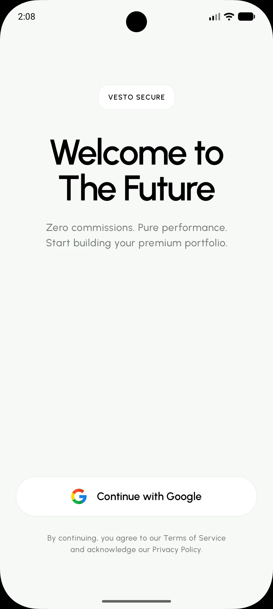
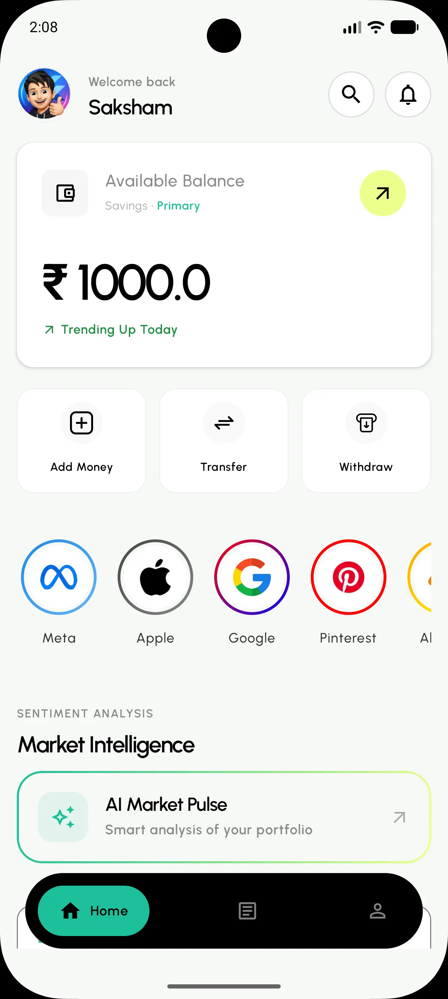
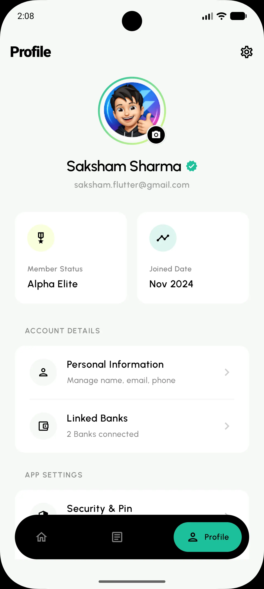

<div align="center">

# 📈 Vesto - Modern Stock Market App

<p align="center">
  
  
  
  
  
</p>

*A high-end, editorial-style Android investment platform built for the modern investor. Vesto combines deep financial analytics with a premium, Gen-Z focused aesthetic.*

[Features](#-key-features) •
[Tech Stack](#-tech-stack-and-architecture) •
[Getting Started](#-getting-started) •
[Visual Showcase](#-visual-showcase)

</div>

---

## ✨ Key Features

| Feature | Description |
| :--- | :--- |
| **🎨 Premium Gen-Z UI** | A stunning editorial design system featuring 24dp radii, high-contrast typography, and deep glassmorphic effects. |
| **🔒 Secure Authentication** | One-tap Google Sign-In integration with Firebase backend for a frictionless and secure onboarding experience. |
| **📉 Interactive Analytics** | High-precision stock charts with scrubbable indicators and smooth interpolation for deep market analysis. |
| **📰 Contextual News** | Integrated real-time financial news feed tailored to your watchlist and market trends. |
| **🏆 Market Movers** | Discover top gainers and losers with an intuitively sorted dashboard. |
| **📱 Edge-to-Edge Experience** | Fully immersive UI that respects system bars and provides a modern, premium feel. |

---

## 🖼️ Visual Showcase

<div align="center">
  <p align="center">
    
    
    
  </p>
  <i>Experience a seamless, fast, and secure investment journey with our premium UI.</i>
</div>

---

## 🛠️ Tech Stack and Architecture

Vesto follows **Clean Architecture** principles and the **MVVM** pattern, organized within a robust **Multi-Module** structure. This ensures scalability, testability, and clear separation of concerns.

### 🏗️ Module Structure

- **`:app`**: Entry point, Hilt dependency graph, and global navigation logic.
- **`:core`**: Foundations shared across the app.
  - `:core:common`: Shared utilities and design tokens.
  - `:core:network`: Centralized Retrofit & OkHttp infrastructure.
  - `:core:database`: Local persistence using Room.
  - `:core:feature_api`: Navigation contracts between features.
- **`:feature`**: Independent business modules (e.g., `auth`, `stock`, `news`).
  - `...:data`: Repository implementations and DTOs.
  - `...:domain`: Business logic, Use Cases, and repository interfaces.
  - `...:ui`: Compose screens and ViewModels.
- **`:utilities`**: Application-wide helper components.

### Core Technologies
- **[Jetpack Compose](https://developer.android.com/jetpack/compose)**: Modern declarative UI toolkit.
- **[Coroutines & Flow](https://kotlinlang.org/docs/coroutines-overview.html)**: Asynchronous programming and reactive streams.
- **[Google Auth](https://developers.google.com/identity/sign-in/android)**: Seamless one-tap authentication.
- **[Firebase](https://firebase.google.com/)**: Backend services for authentication and real-time data.

---

## 🚀 Getting Started

Follow these steps to set up the development environment.

### 📋 Prerequisites
- **Android Studio** (Ladybug or newer)
- **JDK 17+**
- **Android SDK** (Target API 36)

### ⚙️ Configuration

1. **Clone the Repository**
   ```bash
   git clone https://github.com/SakshamSharma2026/Vesto-Stock-market-App.git
   ```

2. **Supply API Credentials**
   Create a `secret.properties` file in the **root directory** with your credentials:
   
   ```properties
   BASE_URL="https://your.api.baseurl.com/"
   API_KEY="your_api_key"
   GOOGLE_CLIENT_ID="your_google_id.apps.googleusercontent.com"
   ```

3. **Firebase Setup**
   Place your `google-services.json` in the `app/` directory.

4. **Build & Run**
   Sync Gradle and run the `app` target.

---

## 🤝 Contributing

Contributions are welcome! Whether it's adding features, fixing bugs, or improving documentation.

<div align="center">
  
Made with ❤️ by Saksham Sharma

</div>
